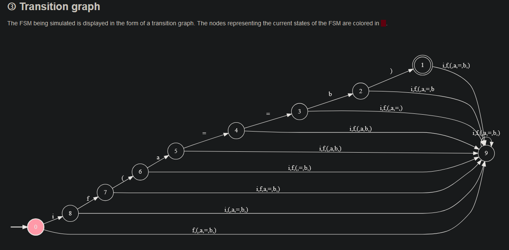
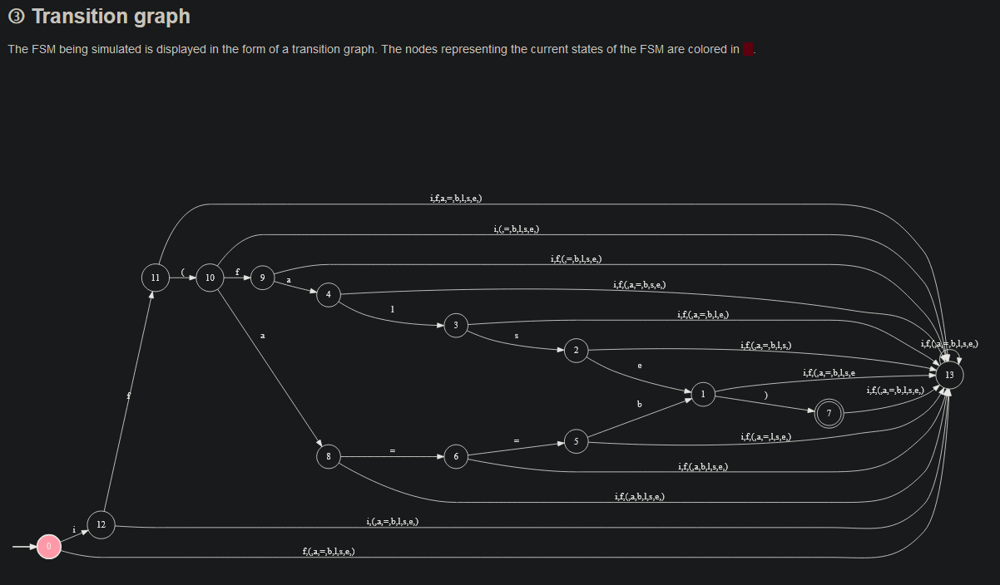
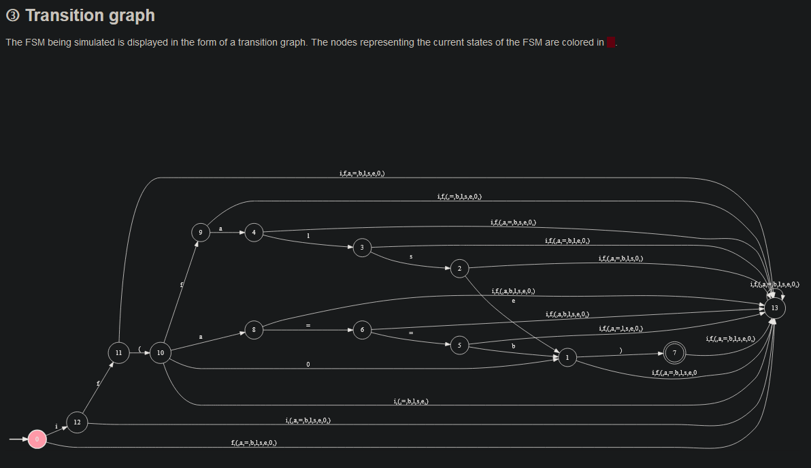

# starter-neural-network

# Calvet Hugo

## Simulateur: 

## Lien des colab: 

Lien Colab Identification des chiffres : https://colab.research.google.com/drive/1gGpTrgSBaXaNFQOdfwxr9KeyJ3iCnTec

Lien Colab emoji: https://colab.research.google.com/drive/18BoTnE7uAQTFqa4Pzzz0lf78AaWsnH-h?usp=sharing

Lien Colab premier neural net: https://colab.research.google.com/drive/1ZAEr0evDXK4FA-kpA5f1oGSUhiy-SzqV#scrollTo=y0YUYU24ZVIv

Lien Colab Fleur: https://colab.research.google.com/drive/1fSsphoG1gJU5DFQmOvSwNXGj39K8ejwG?usp=sharing